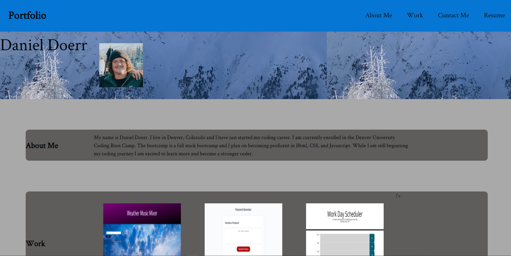

# Professional-Portfolio

## Task

    Updated Portfolio: Added three projects and replaced the images with screenshots.

    I was presented with the task to create a personal portfolio website that showcases my pervious work, gives information about myself, give my contact information, and links my resume. This website was intended to be made by scrath and fulfill certain requirements. This was our first major assignment using css and html together.

## Links to Images Used

https://images.unsplash.com/photo-1618299723086-dca317f56e04?ixid=MnwxMjA3fDB8MHxwaG90by1wYWdlfHx8fGVufDB8fHx8&ixlib=rb-1.2.1&auto=format&fit=crop&w=967&q=80

## Screen Shot Image of Website

## Link to Website

https://dado7639.github.io/Professional-Portfolio/
